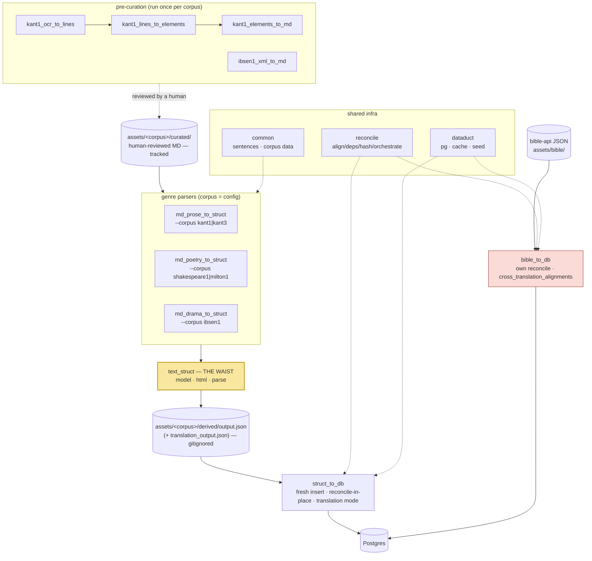
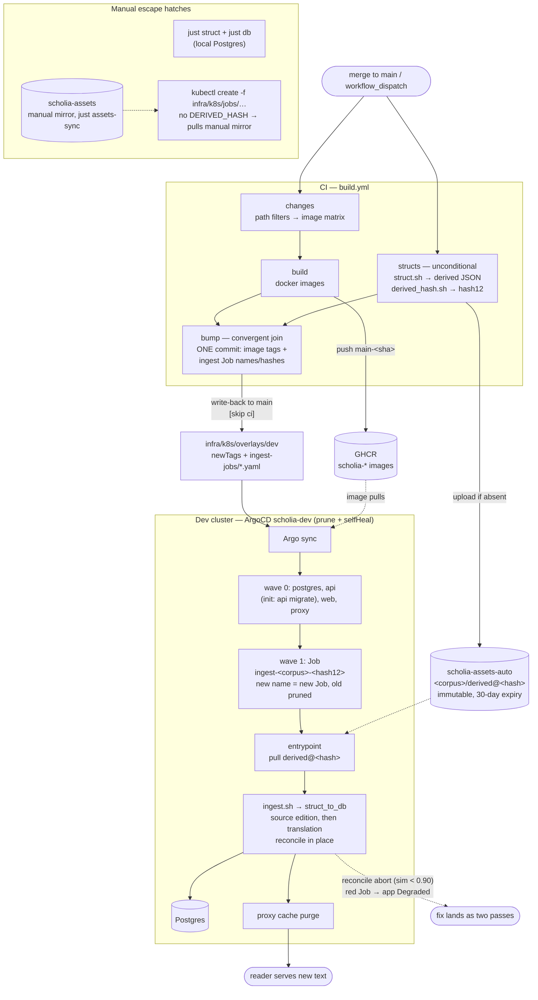

# The content pipeline, end to end

How a text travels from curated markdown to the reader: first the
**crates** (the narrow waist — what transforms what), then the
**deploy flow** (CI/CD — what triggers what). Companion prose:
`docs/adr/0006-ingest-pipeline-narrow-waist.md` (why the waist),
`docs/adr/0007-auto-ingest-content-hash-gitops.md` (why the deploy
flow looks like this, and its rejected alternatives),
`infra/argo/README.md` (day-to-day ops).

Scope notes, valid throughout:

- **Bible is the exception** — its own importer + fetch flow
  (`scripts/db_bible.sh`, `jobs/ingest-bible`), manual kubectl only,
  KJV seeds canonical verse counts first. It sits outside the waist
  and does not ride the auto-ingest flow.
- **Prod (when it exists)** repeats the cluster half from its own
  overlay; its ingest Job manifests move only by *promotion* — copying
  `overlays/dev/ingest-jobs/` into the prod overlay — never by CI
  bump. Same bucket artifacts, byte-identical.

## The crates — one waist, one importer

Every text flows through one midpoint — the **struct JSON**
(`text_struct`), the pipeline's *narrow waist*. Above the waist: one
parser per **genre**. Below it: exactly one of everything. A
**corpus** crosses the waist as data (a `common::<corpus>` module + a
`corpus.rs` builder arm + a `scripts/ingest.sh` entry), never as code.
See ADR 0006.

```
  PRE-CURATION (run once per corpus, output is human-reviewed into curated MD)
  ─────────────────────────────────────────────────────────────────────────
  kant1_ocr_to_lines → kant1_lines_to_elements → kant1_elements_to_md   (Kant OCR)
  ibsen1_xml_to_md                                                      (HIS TEI)

                    assets/<corpus>/curated/  (tracked, human-edited MD)
                                 │
  PARSERS (curated MD → struct JSON; one crate per GENRE, corpus = config)
  ─────────────────────────────────────────────────────────────────────────
  md_prose_to_struct    --corpus kant1|kant3        annotated prose: footnotes,
                        [--translation]             figures, dual page systems
  md_poetry_to_struct   --corpus shakespeare1|milton1  verse: line-per-sentence,
                                                    indent levels
  md_drama_to_struct    --corpus ibsen1             drama: @ speaker / @stage /
                        [--translation]             | verse / {{{ N }}} pages
                                 │
                                 ▼
  THE WAIST ────────── text_struct ──────────────────────────────────────────
                       model  — the one struct-JSON schema (superset:
                                footnotes, indent, NodeSource, …)
                       html   — curated-markdown → HTML helpers
                       parse  — front matter, dir scan, marker resolution
                                 │
                     assets/<corpus>/derived/output.json
                     (+ translation_output.json)   — gitignored, regenerable
                                 │
  IMPORTER (struct JSON → Postgres; exactly one)
  ─────────────────────────────────────────────────────────────────────────
  struct_to_db          fresh insert · reconcile-in-place (sentence UUIDs +
                        anchored quotations survive edits) · translation mode
                        (--source-book-slug, sentence-locked 1:1, footnote-aware)
                                 │
                              Postgres

  OUTSIDE THE WAIST (deliberately — see ADR 0006 for the revisit triggers)
  ─────────────────────────────────────────────────────────────────────────
  bible_to_db           raw bible-api JSON → Postgres directly; own reconcile
                        orchestrator; verse-ref alignment via
                        cross_translation_alignments (not sentence-locked)

  SHARED INFRA (both sides of the waist)
  ─────────────────────────────────────────────────────────────────────────
  common                sentence splitters (de/en/structural) · per-corpus
                        data modules (kant1, kant3, shakespeare1, milton1,
                        ibsen1) · textmatch · epub tooling
  reconcile             align / deps / hash / keys / orchestrate — the
                        in-place re-import toolkit (struct_to_db + bible_to_db)
  dataduct              pg connect options · cache purge · system user
```

The same map as a rendered diagram:



Adding a text of an existing genre (**the new-text test**): curated MD + one
`common::<corpus>` module + one builder arm in the genre parser's `corpus.rs`
+ one word in `scripts/lib.sh` `SCHOLIA_CORPORA` with its case arms in
`scripts/{ingest,struct}.sh` + two thin k8s Job manifests — the manual escape
hatch (`infra/k8s/jobs/`) and the Argo-managed auto-ingest Job
(`overlays/dev/ingest-jobs/`), the only per-corpus deploy artifacts, both on
the same shared image. Zero new crates, Dockerfiles, CI filters, or
front-door entries — `just db <corpus>` / `just struct <corpus>`
parameterize, `just db-reload` iterates `ingest.sh --list`, and CI's
`structs` job iterates `struct.sh --list`. A genuinely new *genre capability*
(a new block type, a new annotation kind) lands once in `text_struct` +
`struct_to_db`, and every genre inherits it.

## The deploy flow — merge to reader

The crate pipeline above runs identically in CI (the `structs` job)
and locally (`just struct`). What follows is how a merge to `main`
carries its output into the cluster.

```
  assets/<corpus>/curated/**  or  parser crates
      │  merge to main
      ▼
CI — .github/workflows/build.yml  (one workflow, one final commit)
      changes ───► build: image matrix ─────────► GHCR images main-<sha>
      (filters)    (api web proxy ingest…)              │
          │                                             │
          └──► structs (unconditional, every run):      │
               scripts/struct.sh <corpus>  ──►  derived JSON (the waist)
               scripts/derived_hash.sh <corpus> ──► <hash12>
               upload if absent ──► scholia-assets-auto/<corpus>/derived@<hash>
                                                        │
      bump (joins build + structs, convergent):         │
        one commit to infra/k8s/overlays/dev — image newTags +
        ingest-jobs/*.yaml (name: ingest-<corpus>-<hash12>, DERIVED_HASH)
      │
      │  git write-back to main [skip ci]
      ▼
ARGO (dev cluster, app scholia-dev; prune + selfHeal)
      wave 0: postgres, api (init container: api migrate), web, proxy
      wave 1: Job ingest-<corpus>-<hash12>
              new name = new resource → Argo creates it, prunes the old
              (kills a still-running predecessor; safe — one tx per edition)
      │
      ▼
JOB POD (image ghcr.io/…/scholia-ingest:main, CORPUS env)
      entrypoint: rclone pull scholia-assets-auto/<corpus>/derived@<hash>
      scripts/ingest.sh <corpus>:
        struct_to_db  --input-file …/output.json              (source edition)
        struct_to_db  --input-file …/translation_output.json  \
                      --source-book-slug <slug>               (translation)
      reconcile in place: sentence UUIDs + anchored quotations survive;
      aborts on ambiguous rewrites (sim < 0.90) → red Job → app Degraded
      │
      ├──► Postgres (books, toc_nodes, content_blocks, sentences, …)
      └──► cache purge (CACHE_PURGE_URL → proxy) ──► reader serves new text

MANUAL LANES (escape hatches, all still live)
  local:    just struct <corpus>  →  just db <corpus>          (local Postgres)
  bucket:   just assets-sync      →  scholia-assets            (manual mirror)
  cluster:  kubectl create -f infra/k8s/jobs/ingest-<corpus>.yaml
            (no DERIVED_HASH → entrypoint pulls scholia-assets instead)
  CI:       workflow_dispatch — inputs: images=false (structs-only),
            corpora=<subset>; also the recovery path when a
            derived@<hash> hits the auto bucket's 30-day expiry
```

The same flow as a rendered diagram:


