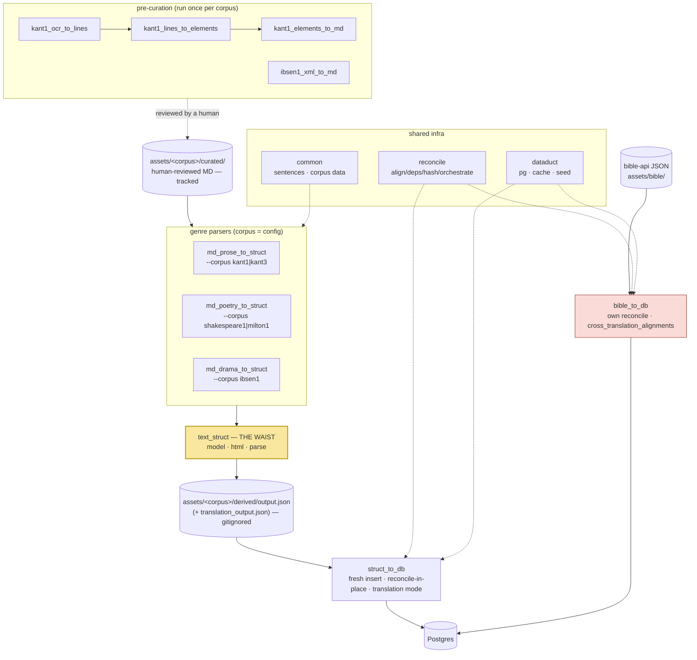

# packages/ — the ingest pipeline crates

Every text flows through one midpoint — the **struct JSON** (`text_struct`),
the pipeline's *narrow waist*. Above the waist: one parser per **genre**.
Below it: exactly one of everything. A **corpus** crosses the waist as data
(a `common::<corpus>` module + a `corpus.rs` builder arm + a
`scripts/ingest.sh` entry), never as code. See ADR 0006.

```
  PRE-CURATION (run once per corpus, output is human-reviewed into curated MD)
  ─────────────────────────────────────────────────────────────────────────
  kant1_ocr_to_lines → kant1_lines_to_elements → kant1_elements_to_md   (Kant OCR)
  ibsen1_xml_to_md                                                      (HIS TEI)

                    assets/<corpus>/curated/  (tracked, human-edited MD)
                                 │
  PARSERS (curated MD → struct JSON; one crate per GENRE, corpus = config)
  ─────────────────────────────────────────────────────────────────────────
  md_prose_to_struct    --corpus kant1|kant3        annotated prose: footnotes,
                        [--translation]             figures, dual page systems
  md_poetry_to_struct   --corpus shakespeare1|milton1  verse: line-per-sentence,
                                                    indent levels
  md_drama_to_struct    --corpus ibsen1             drama: @ speaker / @stage /
                        [--translation]             | verse / {{{ N }}} pages
                                 │
                                 ▼
  THE WAIST ────────── text_struct ──────────────────────────────────────────
                       model  — the one struct-JSON schema (superset:
                                footnotes, indent, NodeSource, …)
                       html   — curated-markdown → HTML helpers
                       parse  — front matter, dir scan, marker resolution
                                 │
                     assets/<corpus>/derived/output.json
                     (+ translation_output.json)   — gitignored, regenerable
                                 │
  IMPORTER (struct JSON → Postgres; exactly one)
  ─────────────────────────────────────────────────────────────────────────
  struct_to_db          fresh insert · reconcile-in-place (sentence UUIDs +
                        anchored quotations survive edits) · translation mode
                        (--source-book-slug, sentence-locked 1:1, footnote-aware)
                                 │
                              Postgres

  OUTSIDE THE WAIST (deliberately — see ADR 0006 for the revisit triggers)
  ─────────────────────────────────────────────────────────────────────────
  bible_to_db           raw bible-api JSON → Postgres directly; own reconcile
                        orchestrator; verse-ref alignment via
                        cross_translation_alignments (not sentence-locked)

  SHARED INFRA (both sides of the waist)
  ─────────────────────────────────────────────────────────────────────────
  common                sentence splitters (de/en/structural) · per-corpus
                        data modules (kant1, kant3, shakespeare1, milton1,
                        ibsen1) · textmatch · epub tooling
  reconcile             align / deps / hash / keys / orchestrate — the
                        in-place re-import toolkit (struct_to_db + bible_to_db)
  dataduct              pg connect options · cache purge · system user
```

The same map as a rendered diagram:



Adding a text of an existing genre (**the new-text test**): curated MD + one
`common::<corpus>` module + one builder arm in the genre parser's `corpus.rs`
+ one word in `scripts/lib.sh` `SCHOLIA_CORPORA` with its case arms in
`scripts/{ingest,struct}.sh`. Zero new crates, Dockerfiles, k8s manifests, CI
filters, or front-door entries — `just db <corpus>` / `just struct <corpus>`
parameterize, and `just db-reload` iterates `ingest.sh --list`. A genuinely new
*genre capability* (a new block type, a new annotation kind) lands once in
`text_struct` + `struct_to_db`, and every genre inherits it.
